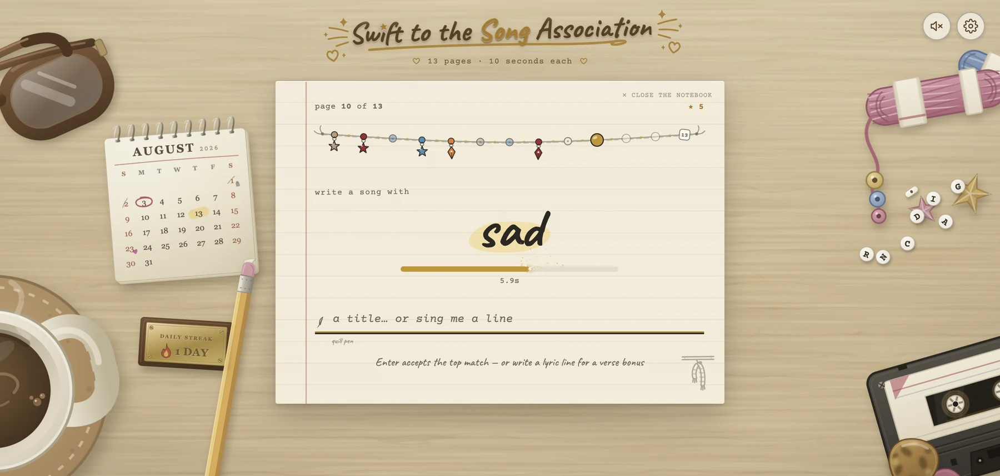

# Welcome to the ✨Swift to the Song Association✨ repository

**[Play it now at swiftassociation.com](https://swiftassociation.com)** (alpha, and yes it works on your phone)

I’m currently working on a game inspired by ELLE’s Song Association. Where, by default, you are given 10 seconds to name a song or lyric with a specific word in it. The twist? It’s all Taylor Swift songs 🫶

*pretty sure that's Taylor Swift*

A round is one word. You get 10 seconds to name a song containing it, or to type a lyric line containing it, and every word you land adds a bead to the friendship bracelet you finish the run with.

The game is still a work in progress and is by no means 'done', but it is quite extensive and very playable right now.

## Standout features

**Ways to play**

- Five difficulty options, with hints if you want them
- Endless mode
- Album focus mode so you can concentrate on ONE album only
- Daily challenge
- The ability to make your own **custom modes**, including a floating word rarity that climbs and falls with how you play
- A guest shelf of other artists' catalogues, played on their own and never mixed into Taylor's
- A shelf of bonus mini-games, including one where you hunt a swapped word in a real lyric
- Ruthless Game, where the song writes itself out a word a second from a section you pick, and your time is the score
- A randomiser that deals one run from anywhere in the notebook, leaning toward what you haven't played yet

**The long game**

- Challenges mode with 32 challenges, most with a harder "dark side" to unlock, plus a super-hard tier unlocked through mastery
- A skills and mastery system full of rewards
- Over 200 achievements, graded by difficulty in the finish of the charm itself, one of which is pinned as a goal you can jump straight into

**The details**

- Every era, plus holiday, movie, collaboration and some unreleased songs
- Unique UI with a notebook theme, and lots and lots of easter eggs
- Lyricist mode, where you answer by typing a lyric line instead of a song title
- Typed titles forgive a slip, so one wrong letter or two swapped ones still names the song
- A streak penciled in the margin that bursts across the page as that many copies of itself, climbing from pencil to your era's own pen to gold
- Beads that record how a page went and not just whether: sanded for a hint taken, pearl for a line written from memory, clear for one you missed
- Ability to save your friendship bracelet, or a bonus run's record sleeve, as a PNG to share your run!
- A companion lyric searcher, [Swift To The Lyric](https://swiftassociation.com/search), for searching every line of every song
- Every panel has its own link, so /records or /charms opens straight onto that page
- Opt-in sound effects
- Installable as a phone or desktop app and works offline once loaded

**There are many features in the works as we speak:**

- More bonus mini-games
- Global leaderboards
- More easter eggs
- More sound design
- Stickers!!
- Fixing up dark mode
- Polaroids in more places!
- More achievements (always)

I want this game to have extensive replay value. I want it to be challenging. I want it to be as good as it can be for as many people as possible, so I’m working on adding accessibility features, and I’m open to all feedback/suggestions. Submit feedback with the feedback button on the site or at https://swiftassociation.com/feedback

Above all, **I want it to be fun.**

If the game doesn’t seem like it’s in a finished state right now, that’s because it isn’t. We’re getting there lol. For now, thank you for reading, and you can play the game RIGHT NOW in its alpha stage at https://swiftassociation.com

*no its becky*

## Licence

The source code in this repository is © Corey Shurdington, all rights reserved. You are very welcome to read it, poke around it, and learn from it. It is not licensed for reuse, redistribution, or deployment, commercially or otherwise. If you want to do something with it, just ask me.

This covers my code only. The lyrics and liner-note messages in `songs.json`, `guests/` and `secret-messages.json` belong to their respective writers and publishers. They are not mine, and nothing above grants any rights to them. The fonts, sound effects and the one borrowed icon carry their own licences, which are set out in [NOTICE.md](NOTICE.md).

Verdict sounds from [Google’s Material Design sound kit](https://archive.org/details/material-design-sound-resources) (CC-BY 4.0); the page turn and the glockenspiel (heard whole on an unlock, and as a single note when a hint reveals) are CC0 recordings from freesound.
